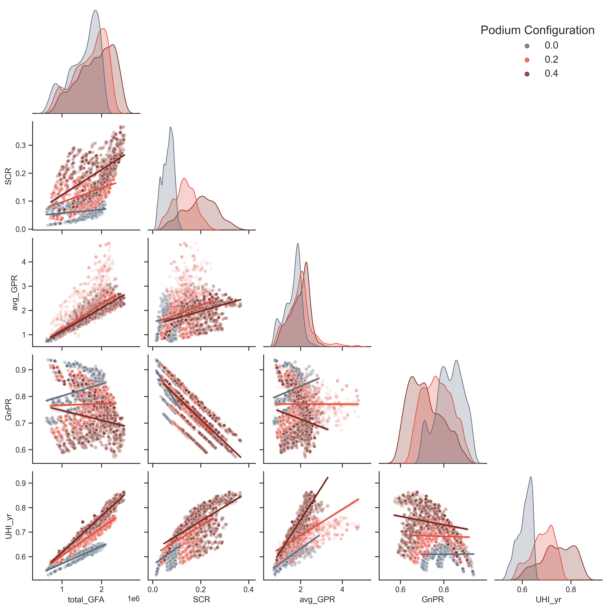
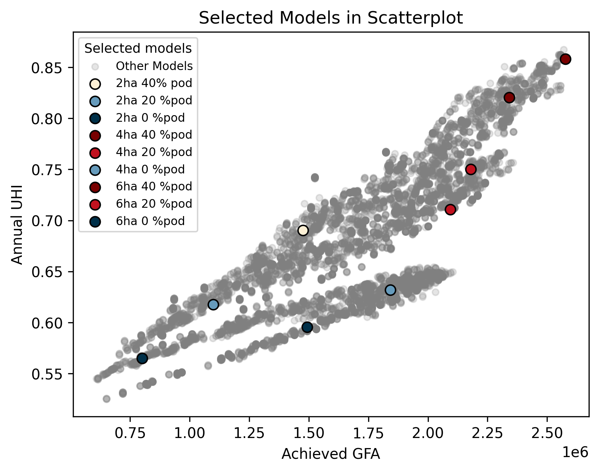
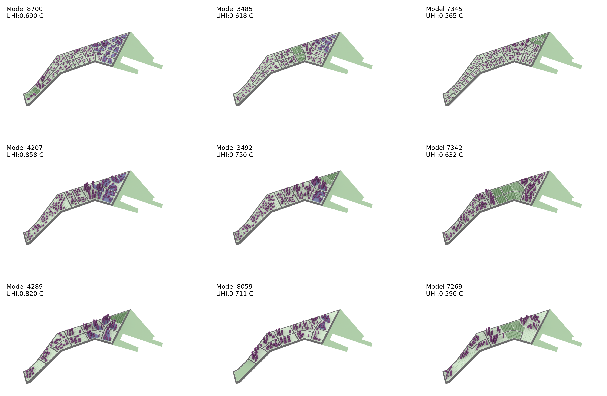

# Urban Data Analytics for Urban Heat Island Metrics

- **Article:** Urban Heat Island Mitigation with Generative Models: A Case Study of Urban Design Exploration for Singapore’s Tropical Climate
  **Journal:** Case Studies in the Environment Special Issue: Case Studies from GIS and Sustainability Science - 2024
- **Authors:** Elif Esra Aydin, F. Peter Ortner, Praveen Govindarajan, JingZhi Tay, Zebin Chen, Peng Song.
- **Institution:** Net Zero Futures Lab (NFZL) and [Adaptive Design Lab](https://adaptivedesignlab.com/) - SUTD
- **Description:** This data analytics code written to analyze an extensive dataset for Urban Heat Island (UHI) metrics. The published code can be used as an examplary practice to learn, reiterate, and improve the visualization skills.

- **Latest update:** 18/10/2024

## **Table of Contents**

- [Prerequisites](#prerequisite)
- [Sample Dataset](#sample-dataset)
- [Studied Visualization](#studied-visualization)
- [Dataset Summary](#dataset-summary)
- [Sample Models](#sample-models)
- [Acknowledgement](#acknowledgement)
- [Links](#links)

## **Prerequisite**

To work with the shared dataset and the code, you may need this step to complete this installation stage. Please read carefully and follow the instructions.

Visual Studio Code & Python installation:

1. Download Visual Studio Code (VSC), for more information: [Visual Studio Code](https://code.visualstudio.com/)
2. Open the shared jupyter notebook code with VSC: **CSE_visualizationCode_NZFL.ipynb**
3. Download the suggested Python in VSC platform

Python libraries installation:
This study requests 4 libraries to work on data frames and their visualization:

- pandas
- numpy
- seaborn
- matplotlib

For their installation, please follow the following steps.

1. Open a terminal for “command prompt” from the search tab of your computer.
2. When terminal is opened, please install the libraries by writing the given codes below in the terminal subsequently:

> pip install pandas numpy seaborn matplotlib

## **Sample Dataset**

This study will provide a framework to understand the performance of UHI and analyze three metrics, namely annual mean UHI (UHI_yr), nighttime UHI (UHI_n), and daytime UHI (UHI_d).

- Annual UHI (UHI_yr) refers to the yearly average dry bulb temperature difference between the default and the newly morphed data.
- Daytime UHI (UHI_d) hours were assigned between 7am and 7pm to reflect Singapore’s equatorial climate, with the remaining hours assigned to nighttime UHI (UHI_n) as applied in Aydin et al. (2024).

This code is conducted by using UHI_yr metric and its dataset, the other metrics' datasets are shared to permit readers to practice on data with UHI_n and UHI_d. Please refer to XXXXX file to download the datasets.

## **Dataset Summary**

### Input parameters/output metrics

| Input Parameters      | Planning Metrics          | Output Metrics        |
| --------------------- | ------------------------- | --------------------- |
| Parcel Area           | Gross Floor Area (GFA)    | Annual UHI (UHI_yr)   |
| Road Density          | Gross Plot Ratio (GPR)    | Nighttime UHI (UHI_n) |
| Park Location         | Site Coverage Ratio (SCR) | Daytime UHI (UHI_d)   |
| Park Radius           | Building Height (BH)      |                       |
| Tree Coverage Density | Green Plot Ratio (GnPR)   |                       |
| Building Density      | Tree Coverage Ratio (TCR) |                       |
| Podium Density        |                           |                       |
| Roof Type             |                           |                       |

### **Dataset glossary**

| Input/Output Names | Definitions                                                |
| ------------------ | ---------------------------------------------------------- |
| sim_no             | Simulation number                                          |
| UHI_yr             | Annual mean Urban Heat Island metric                       |
| UHI_d              | Daytime annual mean Urban Heat Island metric               |
| UHI_n              | Night-time annual mean Urban Heat Island metric            |
| asphalt_ratio      | Ratio of total road area to analyzed site area             |
| park_grass_ratio   | Ratio of park grasscover to analyzed site area             |
| parcel_grass_ratio | Ratio of tower parcel grasscover to analyzed site area     |
| podium_grass_ratio | Ratio of podium parcel grasscover to analyzed site area    |
| GnPR               | Ratio of total grasscover area to analyzed site area       |
| TCR                | Ratio of tree canopy projection area to analyzed site area |
| greenroof_ratio    | Ratio of greenroof area to analyzed site area              |
| SCR                | Site coverage ratio                                        |
| parcel_fp_ratio    | Ratio of tower footprint coverage ratio                    |
| podium_fp_ratio    | Ratio of podium footprint coverage ratio                   |
| tower_GFA          | Achieved tower building area                               |
| podium_GFA         | Achieved total podium building area                        |
| total_GFA          | Achieved GFA (both tower and podium)                       |
| avg_BH             | Average Building Height of entire site                     |
| avg_GPR            | Average achieved GPR of entire site                        |
| parcelArea         | minimum Hectare per parcel                                 |
| parkLocation       | Fraction factor per site                                   |
| parkRadius         | Coordinate in the site                                     |
| roadDensity        | Radius in meter                                            |
| bldDensity         | Percentage factor per site                                 |
| podiumDensity      | Number of buildings per parcel                             |
| treeDensity        | Fraction factor per site                                   |
| roofType           | material characteristics†                                  |

---

## **Studied visualizations**

### 1. Heatmap: Correlation coefficient visualization : Spearman Correlation Analysis

## 

---

### 2. Scatterplot: Pairplot visualization with Kernel Density Distribution

## 

---

### 3. Scatterplot: Filtered solutions (Single- / Multi-plot Data filtering)

## 

---

### 4. Scatterplot: Selected solutions (Single-plot Data filtering)

## 

---

### **Sample Models**

## 

---

## Acknowledgement

This study is conducted as a part of the project “Computational Modelling for Optimisation of Planning and Urban Design Parameters,” led by F. Peter Ortner.
Its preliminary version was presented at Singapore Urban Redevelopment Authority’s Shaping a Heat Resilient City Exhibition in 2023. This project is funded by Urban Redevelopment Authority (URA) of Singapore.

## Links

### Project References

- Case Study Publication: [Aydin et al. (2024 -CSE)](https://github.com/NetZeroFuturesLabSUTD/CSE_UHI_dataAnalysis?tab=readme-ov-file#introduction)

- Co-generation study: [Chen et al. (2024)](https://doi.org/10.1111/cgf.15053)
- Urban fabric optimizer study: [Ortner et al. (2023a)](https://ieeexplore.ieee.org/document/10155367)
- Urban fabric generator study: [Ortner et al. (2023b)](https://doi.org/10.52842/conf.ecaade.2023.1.721)

  **_Further Design and Evaluation Studies_**

- Optimization study - I: [Govindarajan and Ortner (2024)](https://publications.ibpsa.org/proceedings/simbuild/2024/papers/simbuild2024_2252.pdf)
- Optimization study - II: [Govindarajan et al. (2024)](https://papers.cumincad.org/data/works/att/ecaade2024_225.pdf)
- Sensitivity Analysis study: [Aydin et al. (2024)](https://doi.org/10.1016/j.scs.2024.105779)

### **LinkedIn**

- [Elif Esra Aydin](https://www.linkedin.com/in/elif-esra-ayd%C4%B1n-526b5064/)
- [Praveen Govindarajan](https://www.linkedin.com/in/praveen-govindarajan-74403/)
- [F. Peter Ortner](https://www.linkedin.com/in/f-peter-ortner-733b3913/)
- [JingZhi Tay](https://www.linkedin.com/in/tay-jing-zhi-b5b6a5141/)
- [Zebin Chen](https://www.linkedin.com/in/zebin-chen-9a52b9190/)
- [Peng Song](https://www.linkedin.com/in/peng-song-58b5235a/)
