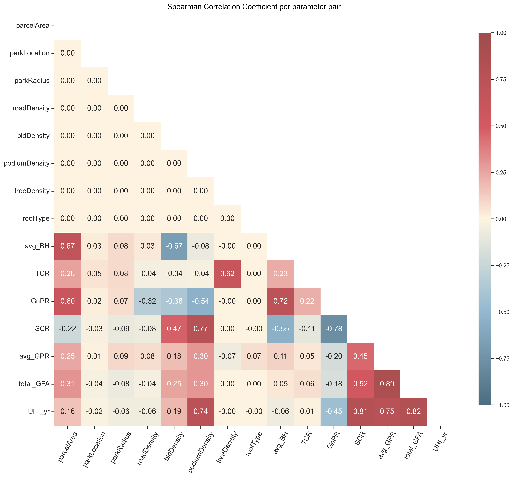

# Urban Data Analytics for Urban Heat Island Metrics

## Table of Contents

- [Introduction](#introduction)
- [Prerequisites](#prerequisite)
- [Sample Dataset](#sample-dataset)
- [Studied Visualization](#studied-visualization)
- [Dataset Summary](#dataset-summary)
- [Supplementary Documents](#supplementary-documents)
- [Acknowledgement](#acknowledgement)
- [Links](#links)

## Introduction:

This data analytics code written to analyze an extensive dataset for Urban Heat Island (UHI) metrics. The published code can be used as an examplary practice to learn, reiterate, and improve the visualization skills.

This is a supplementary document for publication, namely "Urban Heat Island Mitigation with Generative Models: A Case Study of Urban Design Exploration for Singapore’s Tropical Climate" written by Elif Esra Aydin, F. Peter Ortner, Peng Song, Praveen Govindarajan, JingZhi Tay, Zebin Chen.

Case Studies in the Environment Special Issue: Case Studies from GIS and Sustainability Science - 2024

Net Zero Futures Lab (NFZL) - SUTD
Latest update: 18/10/2024

## Prerequisite:

To work with the shared dataset and the code, you may need this step to complete this installation stage. Please read carefully and follow the instructions.

Visual Studio Code & Python installation:

1. Download Visual Studio Code (VSC), for more information: https://code.visualstudio.com/
2. Open the shared jupyter notebook code with VSC: #insert githubLink
3. Download the suggested Python in VSC platform

Python libraries installation:
This study requests 4 libraries to work on data frames and their visualization:

- pandas
- numpy
- seaborn
- matplotlib

For their installation, please follow the following steps.

1. Open a terminal for “command prompt” from the search tab of your computer.
2. When terminal is opened, please install the libraries by writing the given codes below in the terminal subsequently:

> pip install pandas numpy seaborn matplotlib

## Sample Dataset

This study will provide a framework to understand the performance of UHI and analyze three metrics, namely annual mean UHI (UHI_yr), nighttime UHI (UHI_n), and daytime UHI (UHI_d).

- Annual UHI (UHI_yr) refers to the yearly average dry bulb temperature difference between the default and the newly morphed data.
- Daytime UHI (UHI_d) hours were assigned between 7am and 7pm to reflect Singapore’s equatorial climate, with the remaining hours assigned to nighttime UHI (UHI_n) as applied in Aydin et al. (2024).

This code is conducted by using UHI_yr metric and its dataset, the other metrics' datasets are shared to permit readers to practice on data with UHI_n and UHI_d. Please refer to XXXXX file to download the datasets.

## Studied visualizations

- 1. Heatmap: Correlation coefficient visualization

### Spearman Correlation Analysis

- 2. Scatterplot: Pairplot visualization

### Pairplot with Kernel Density Distribution

- 3. Scatterplot: Filtered solutions

### Single- / Multi-plot Data filtering

- 4. Scatterplot: Selected solutions

### Single-plot Data filtering

## Dataset Summary

### Input parameters/output metrics

| Input Parameters      | Planning Metrics          | Output Metrics        |
| --------------------- | ------------------------- | --------------------- |
| Parcel Area           | Gross Floor Area (GFA)    | Annual UHI (UHI_yr)   |
| Road Density          | Gross Plot Ratio (GPR)    | Nighttime UHI (UHI_n) |
| Park Location         | Site Coverage Ratio (SCR) | Daytime UHI (UHI_d)   |
| Park Radius           | Building Height (BH)      |                       |
| Tree Coverage Density | Green Plot Ratio (GnPR)   |                       |
| Building Density      | Tree Coverage Ratio (TCR) |                       |
| Podium Density        |                           |                       |
| Roof Type             |                           |                       |

### Dataset glossary

################ ADD here all information about
'sim_no' :'simulation count ', # can remove
| Input Parameters | Planning Metrics |
| --------------------- | ------------------------- |
| UHI_yr | Annual UHI measure |
| UHI_d | Daytime Urban Heat Island measure |
| UHI_n | Night-time Urban Heat Island measure |
| asphalt_ratio | road arera to development area |
| park_grass_ratio | parks with grasscover ? |  
| parcel_grass_ratio | parcels with grasscover ? |
| podium_grass_ratio | Podiums with grasscover |
| GnPR | All with grasscover |
| TCR | ratio of tree folliage area to developemnt area |
| greenroof_ratio | ratio of greenroof area to developemnt area |
| SCR | Site coverage ratio |
| parcel_fp_ratio | Avg Parcel size to footprint coverage ratio |
| podium_fp_ratio | Avg Parcel size to podium coverage ratio |
| tower_GFA | achieved building area |
| podium_GFA | achieved total podium area |
| total_GFA | achievedGFA |
| avg_BH | average BuildingHeight |
| podium_par_GPR | neverMind |
| tower_par_GPR | neverMind |
| avg_GPR | average achived GPR |

## Supplementary Documents

!!! write here the Supplementary documents details

## Acknowledgement

This study is conducted as a part of the project “Computational Modelling for Optimisation of Planning and Urban Design Parameters,” led by F. Peter Ortner.
Its preliminary version was presented at Singapore Urban Redevelopment Authority’s Shaping a Heat Resilient City Exhibition 2023. This project is funded by Urban Redevelopment Authority (URA) of Singapore, grant number: RGURA2101.

## Links

- [VisualStudioCode](https://code.visualstudio.com/)
- [Aydin et al. (2024)](https://doi.org/10.1016/j.scs.2024.105779)
- [Aydin et al. (2024 -CSE)](????)
